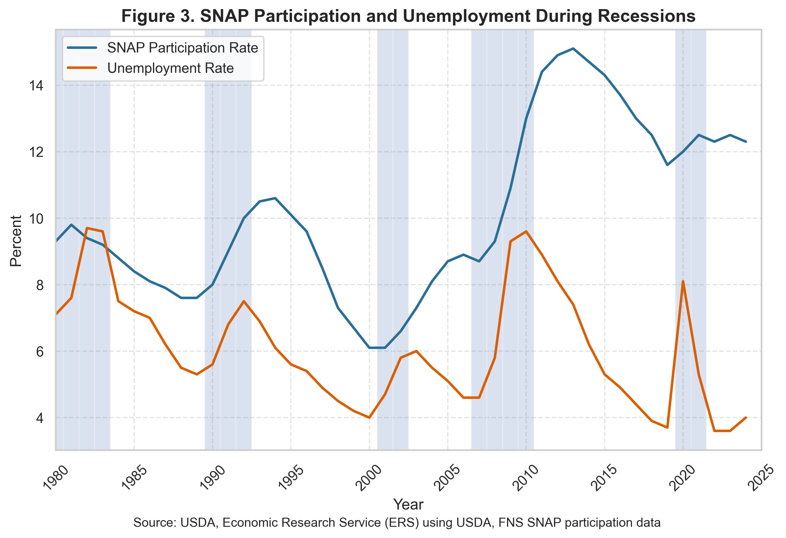
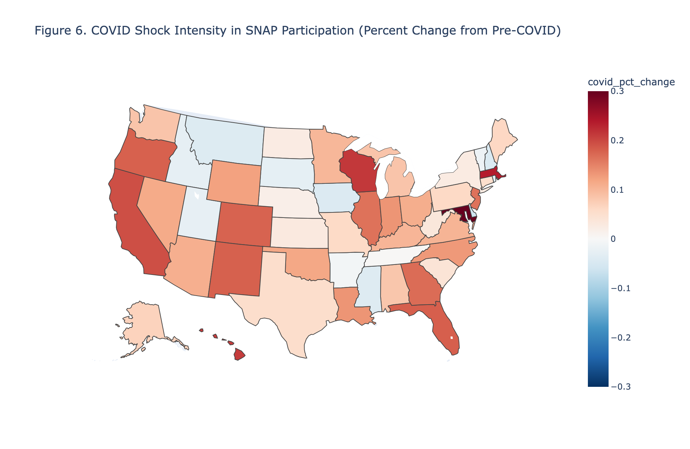
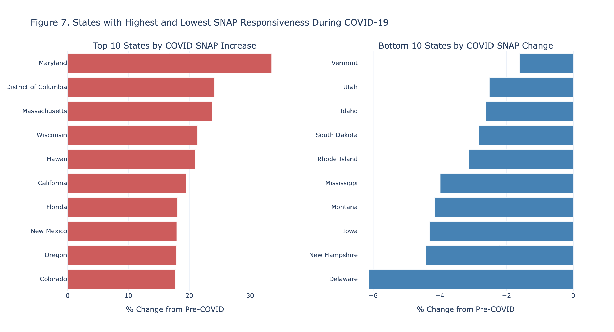
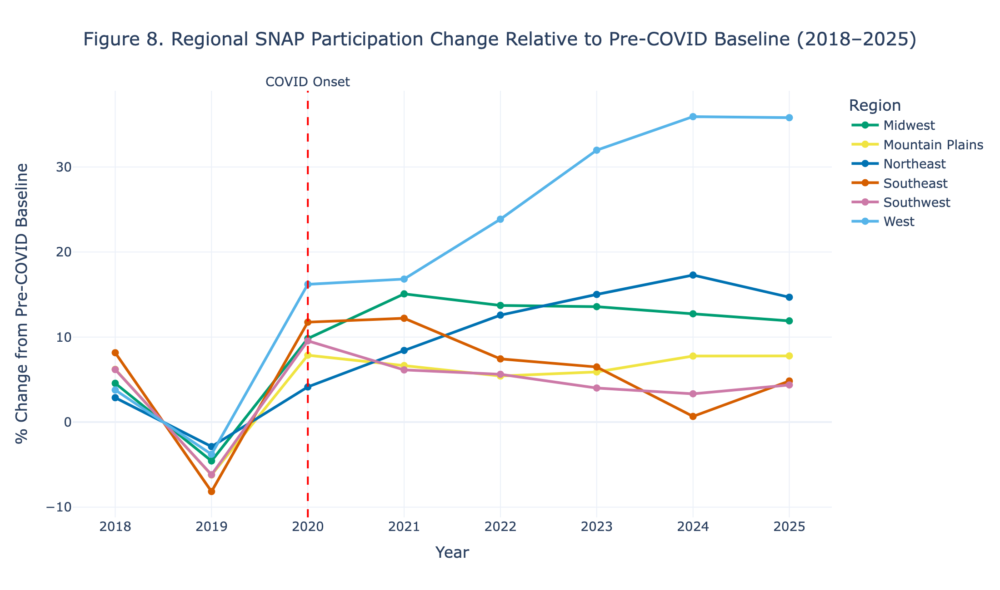

# Executive Summary

## What is SNAP? 

In the United States....

::: {.incremental}
- 48 million people face food insecurity
- 1 in 7 households are food insecure
- Nearly 14 million kids don’t have consistent access to daily meals 
:::

The Supplemental Nutrition Assistance Program (SNAP) is the largest federal nutrition assistance program in the United States, often used as an indicator of economic distress and recovery. 

## Research Abstract

**Importance:**

SNAP participation rose from 36.9 million in February 2020 to over *43 million* by May 2020 due to pandemic-related economic disruptions...

**Gap:**

Which areas of the U.S. saw the most variation in their SNAP participation during the pandemic period, and why.

**Question:**

How did SNAP participation change across U.S. states during COVID-19,  
and why were these impacts geographically uneven?

## Data Overview

**Source:**

United States Department of Agriculture (USDA) & Food and Nutrition Service (FNS)

**Key Variables:**

::: {.incremental}
- 50 States + DC 
- SNAP Participants per month (FY2018 - FY 2026) 
- Period aggregations: Pre, Shock, Recovery, Post
:::

**Methodology:**

::: {.incremental}
1. Load data (read_excel)
2. Create aggregations, add state/region codes, and index % change
3. Plot + Visualize
:::

## Key Visuals - National Trends

The shaded regions represent periods of recession in the U.S., where you can see unemployment and SNAP participation both spike.

## Key Visuals - State-Level Trends

Majority of states seem to be colored red, indicating some positive percent change in participation rates during the COVID-19 pandemic.

## Key Visuals - Biggest Winners/Losers

Ranking of the ten states with the largest and smallest percentage increases in SNAP participation during the COVID shock period

## Discussion

**Findings:**

::: {.incremental}
- COVID-19 emerges as a clear structural shock, associated with a significant increase in SNAP participation of roughly 27–36%. 
- Regression results indicate that this effect is statistically significant, while also showing that the pandemic’s impact was broadly consistent across regions.
:::

**Limitations:**

::: {.incremental}
- Aggregated state-level data masks within-state variation  
- SNAP participation ≠ full food insecurity measure  
- COVID policy differences not fully modeled  
:::

## Conclusion

COVID-19 did not produce a uniform SNAP response...  
**geography strongly shaped the magnitude of economic need.**

COVID-19 represents a clear example of the geographic inequality and large-scale macroeconomic shocks, producing a substantial and widespread increase in participation across nearly all regions. 

